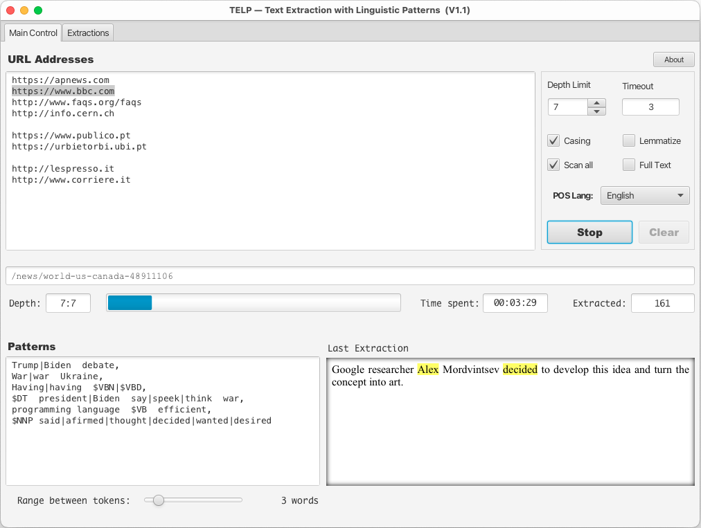

# TELP - Text Extraction with Linguistic Patterns

TELP is a powerful and intuitive tool designed to simplify the extraction of linguistic patterns from web texts. Developed with the needs of linguists and researchers in mind, TELP allows users to easily define and extract complex linguistic patterns from a vast array of web resources. Whether you are conducting a study in discourse relations, exploring syntactic structures, or building corpora for under-resourced languages, TELP provides the precision and ease of use required for comprehensive linguistic analysis.

<!---:label:figure-mainview --->
*Figure 1: The TELP application main view.*

The application addresses a significant gap in the availability of user-friendly tools tailored for linguistic pattern extraction. Existing web crawlers and text extraction tools are often too general or require substantial technical expertise, making them unsuitable for targeted linguistic research. TELP bridges this gap by offering a highly configurable yet easy-to-use interface that empowers researchers from diverse backgrounds to gather relevant linguistic data efficiently.

TELP is particularly valuable for linguistic studies involving under-resourced languages, where the lack of adequate corpora and resources can hinder research progress. By leveraging TELP's capabilities, researchers can automatically collect and analyze large volumes of text, uncovering patterns and insights that contribute to understanding and preserving linguistic diversity.

## Features
- **User-Friendly Interface**: Simplified GUI that allows for quick learning and broad usage by non-technical users.
- **High Precision**: Define detailed linguistic patterns for precise text extraction.
- **Multi-Language Support**: Configurable for various languages, facilitating global linguistic research.
- **Customizable Crawling Parameters**: Set specific URLs, crawling depth, and timeout settings.

## Installation

### Windows

1. Download the latest Windows installer from the [releases](https://www.di.ubi.pt/~jpaulo/a/TELP-1.1.exe) page.
2. Run the installer and follow the on-screen instructions.
3. Once installed, launch TELP from the Start Menu or desktop shortcut.

### MacOS X

1. Download the latest MacOS X installer from the [releases](https://www.di.ubi.pt/~jpaulo/a/TELP-1.1.dmg) page.
2. Open the downloaded `.dmg` file and drag the TELP application to your Applications folder.
3. Open TELP from the Applications folder.

## Usage

1. Launch TELP on your computer.
2. Input the base URLs from which you want to extract text.
3. Define your extraction patterns using simple lexical and syntactic rules.
4. Configure the crawling parameters such as depth and timeout.
5. Start the extraction process and view the results in real-time.

## Contributing

We welcome contributions from the community! If you find a bug or have a feature request, please open an issue. For code contributions, please fork the repository and submit a pull request.

## License

TELP is released under the [MIT License](https://en.wikipedia.org/wiki/MIT_License).

## Contact

For any questions or support, please contact João Cordeiro at [jpcc@ubi.pt](mailto:jpcc@ubi.pt).

---

Thank you for using TELP! We hope this tool significantly enhances your linguistic research and helps uncover valuable insights.
